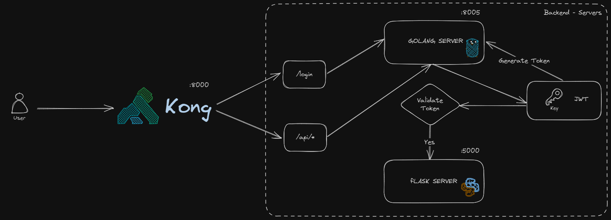
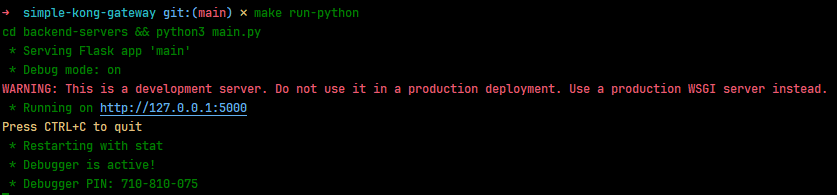
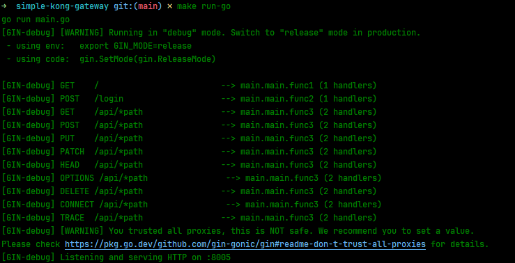
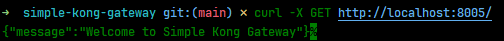
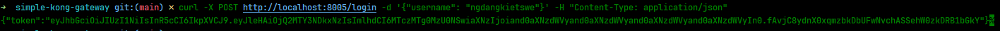
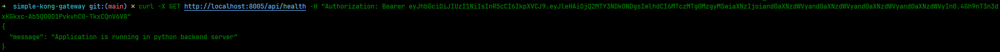
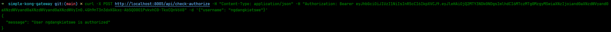

## QUICK START

1. Install Docker and Docker Compose
2. Clone this repository
3. Diagram:
   
   
5. Run Flask app:

    ```bash
    make run-python
    ```
   
6. Run Golang app:

    ```bash
    make run-go
    ```
   
7. Run Flask and Golang app with Docker Compose:

    ```bash
    make docker-run
    ```
8. Run Kong Gateway:

    ```bash
    make run-kong
    ```
   
9. Http request:

    - Test Golang app:
        ```bash
        curl -X GET http://localhost:8000/
        ```
      
    - Test Login:
        ```bash
        curl -X POST http://localhost:8000/login -H "Content-Type: application/json" -d '{"username": "ngdangkietswe"}'
        ```
      
    - Test Flask app with Token:
        ```bash
        curl -X GET http://localhost:8000/api/health -H "Authorization: Bearer {token}" 
        ```
      
        ```bash
        curl -X POST http://localhost:8000/api/check-authorize -H "Content-Type: application/json" -H "Authorization: Bearer {token}" -d '{"username": "ngdangkietswe"}' 
        ```
      
<<<<<<< Updated upstream
=======
9. Documentation:
    - https://docs.konghq.com/
>>>>>>> Stashed changes
